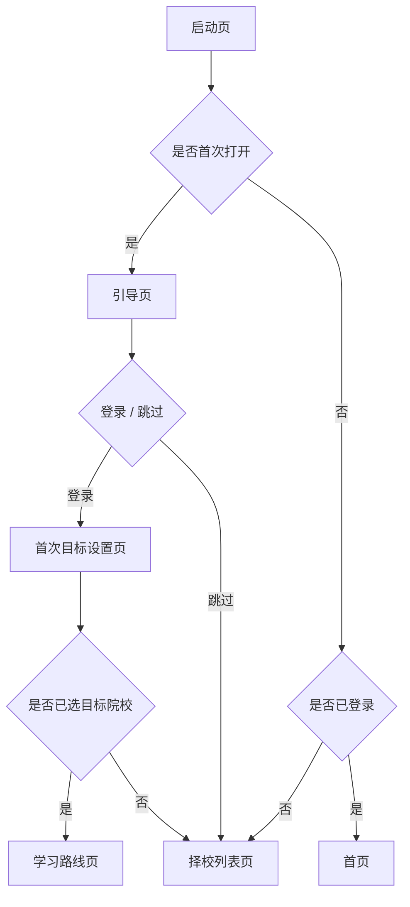
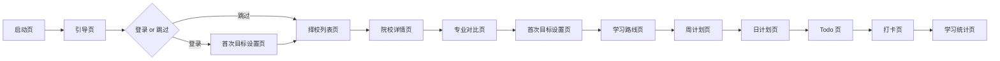
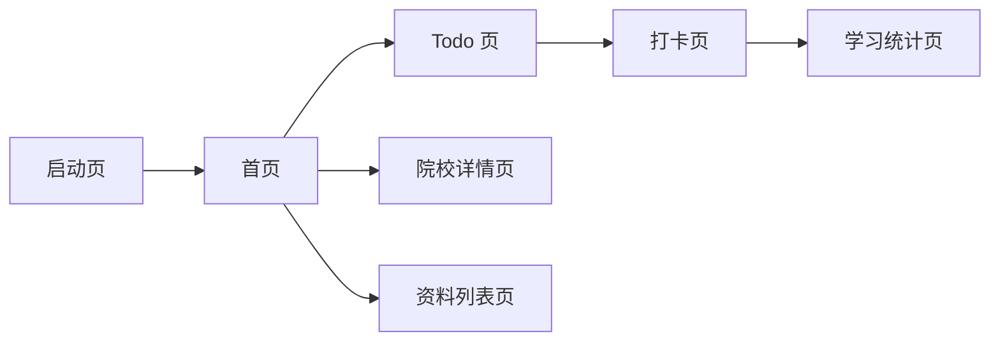
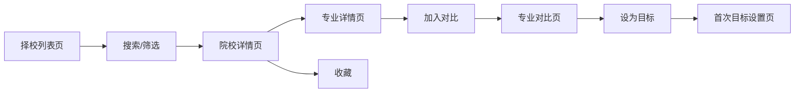
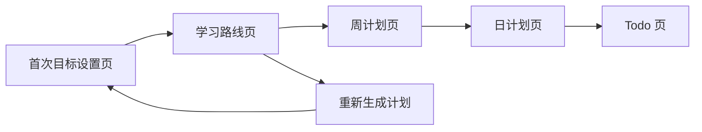
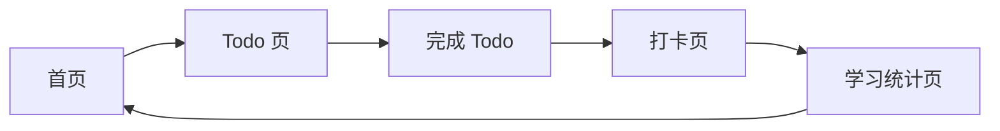

# SureGrad 页面流程与信息架构文档

版本：`v0.2`

日期：`2026-05-16`

关联文档：
- [project-plan.md](C:/Users/hp/Documents/SureGrad/docs/project-plan.md)
- [prd.md](C:/Users/hp/Documents/SureGrad/docs/prd.md)

适用范围：`Android MVP`

## 1. 文档目标

本文档用于补全 SureGrad MVP 的页面流程与信息架构，供产品、设计、前端、后端和测试统一对齐。文档重点覆盖：

1. 新用户主流程
2. 回访用户主流程
3. 择校流程
4. 学习规划流程
5. Todo / 打卡流程
6. 页面进入路径、核心操作、出口跳转、空态和异常态
7. 底部导航结构、关键页面关系和首次引导逻辑

## 2. 范围与原则

## 2.1 仅覆盖 MVP

本文档只覆盖 PRD 已纳入 MVP 的页面与流程：

1. 登录与基础档案
2. 择校列表、院校详情、专业详情、收藏、对比
3. 目标设置、学习路线、周计划、日计划、Todo、打卡、学习统计
4. 资料列表、资料详情
5. 提醒中心、个人中心

以下内容不在本文档流程范围内：

1. 社区
2. 即时聊天
3. AI 个性化生成
4. 调剂专区
5. 课程付费商城

## 2.2 流程设计原则

1. 以 `查院校 -> 收藏对比 -> 设定目标 -> 生成学习计划 -> 执行 Todo -> 打卡复盘` 为核心闭环。
2. 游客允许先浏览内容，但涉及用户资产沉淀的操作统一登录拦截。
3. 登录成功后返回原触发页面，不强制回首页。
4. 所有核心页面必须定义空态和异常态，避免无反馈页面。
5. 只保留 5 个底部一级入口，避免结构膨胀。

## 3. 信息架构

## 3.1 底部导航结构

| Tab | 目标 | 默认承载内容 | 主要二级页面 |
| --- | --- | --- | --- |
| 首页 | 承接回访用户的今日执行任务 | 今日待办、倒计时、学习概览、本周进度、目标院校入口、推荐资料、提醒 | Todo、打卡、学习统计、院校详情、资料列表 |
| 择校 | 支持用户完成检索、收藏、对比和决策 | 搜索、筛选、院校列表、最近浏览、收藏入口 | 院校详情、专业详情、对比页、收藏页 |
| 规划 | 将目标转成长期与短期执行计划 | 目标设置、学习路线、周计划、日计划、Todo、打卡 | 学习路线、周计划、日计划、Todo、打卡、学习统计 |
| 资料 | 提供合法公开的备考资料 | 分类、学科筛选、阶段筛选、资料列表 | 资料详情 |
| 我的 | 管理个人信息和个人资产 | 基础信息、目标院校、学习计划、收藏、提醒设置、反馈 | 收藏页、学习统计页、提醒中心 |

## 3.2 页面层级

```text
SureGrad
├─ 启动与引导
│  ├─ 启动页
│  ├─ 引导页
│  └─ 登录页
├─ 首页
├─ 择校
│  ├─ 择校列表页
│  ├─ 院校详情页
│  ├─ 专业详情页
│  ├─ 专业对比页
│  └─ 收藏页
├─ 规划
│  ├─ 首次目标设置页
│  ├─ 学习路线页
│  ├─ 周计划页
│  ├─ 日计划页
│  ├─ Todo 页
│  ├─ 打卡页
│  └─ 学习统计页
├─ 资料
│  ├─ 资料列表页
│  └─ 资料详情页
└─ 我的
   ├─ 个人中心
   └─ 提醒中心
```

## 3.3 权限分层

| 页面/动作 | 游客可访问 | 登录必需条件 |
| --- | --- | --- |
| 启动页、引导页 | 是 | 否 |
| 择校列表页、院校详情页、专业详情页 | 是 | 否 |
| 资料列表页、资料详情页 | 是 | 否 |
| 首页基础态、个人中心未登录态 | 是 | 否 |
| 收藏院校、收藏资料 | 否 | 是 |
| 加入对比、进入对比页 | 否 | 是 |
| 目标设置、学习路线、周计划、日计划、Todo、打卡、统计 | 否 | 是 |
| 提醒中心 | 否 | 是 |

## 4. 首次引导逻辑



首次引导规则：

1. 首次打开必进 `引导页`。
2. 选择 `登录` 后进入 `首次目标设置页`，先完成基础档案。
3. 目标院校允许暂时为空；若为空，则继续进入 `择校列表页`。
4. 选择 `跳过` 的游客默认进入 `择校列表页`，以最快感知产品价值。
5. 游客在收藏、对比、设目标、生成计划、Todo、打卡等动作上触发登录拦截。
6. 登录成功后回到原触发路径继续，而不是固定回首页。

## 5. 五条主流程

## 5.1 新用户主流程



新用户主流程说明：

1. 用户先理解产品价值和核心闭环。
2. 登录用户先完成基础档案，未登录用户先浏览择校内容。
3. 用户在择校页筛选院校，进入详情，收藏并加入对比。
4. 用户在对比页选定目标专业，并据此落到目标设置。
5. 用户完成目标设置后生成学习路线。
6. 用户从路线进入周计划、日计划和 Todo。
7. 用户完成首次打卡并看到学习统计，形成首次闭环。

## 5.2 回访用户主流程



回访用户主流程说明：

1. 已登录用户默认进入 `首页`。
2. 首页优先展示今日待办、倒计时和是否已打卡。
3. 用户从首页进入 `Todo 页` 完成执行。
4. 学习后进入 `打卡页`，完成后进入 `学习统计页` 查看反馈。
5. 如有额外需求，可从首页回到 `院校详情页` 或 `资料列表页`。

## 5.3 择校流程



择校流程说明：

1. 用户从 `择校列表页` 通过搜索和筛选缩小范围。
2. 用户进入 `院校详情页` 看核心决策数据。
3. 用户可继续查看 `专业详情页`。
4. 用户可收藏院校、专业或资料，其中对比动作以前台专业粒度为准。
5. 用户在 `专业对比页` 横向比较后，选择其中一个目标进入 `首次目标设置页`。

## 5.4 学习规划流程



学习规划流程说明：

1. 用户填写目标院校、目标专业、基础情况和每日可投入时长。
2. 系统按模板生成 `学习路线页`。
3. 用户查看 `周计划页`，再进入 `日计划页`。
4. `日计划页` 中的任务落到 `Todo 页`。
5. 如用户改变目标或规划强度，可回到 `首次目标设置页` 重新生成。

## 5.5 Todo / 打卡流程



Todo / 打卡流程说明：

1. 用户从首页查看今日待办并进入 `Todo 页`。
2. 用户完成 Todo 后，首页待办数量实时更新。
3. 用户进入 `打卡页` 提交学习时长，查看系统带出的完成 Todo 数量并填写复盘备注。
4. 打卡完成后进入 `学习统计页` 查看反馈，再回到首页继续下一轮执行。

## 6. 关键页面关系

| 来源页 | 触发动作 | 目标页 | 备注 |
| --- | --- | --- | --- |
| 启动页 | 首次打开 | 引导页 | 首次安装进入 |
| 启动页 | 已登录 | 首页 | 回访用户默认入口 |
| 启动页 | 未登录且非首次 | 择校列表页 | 游客体验入口 |
| 引导页 | 登录并开始 | 首次目标设置页 | 进入档案与目标设置 |
| 引导页 | 跳过先看看 | 择校列表页 | 游客直接体验 |
| 登录页 | 登录成功 | 原触发页 | 收藏、对比、计划等动作回流 |
| 首页 | 今日待办 | Todo 页 | 高频主入口 |
| 首页 | 去打卡 | 打卡页 | 当日未打卡时显示 |
| 首页 | 学习概览 / 本周进度 | 学习统计页 | 执行反馈入口 |
| 首页 | 目标院校入口 | 院校详情页 | 查看当前目标院校 |
| 首页 | 推荐资料 | 资料列表页 | 辅助内容入口 |
| 择校列表页 | 点击院校卡片 | 院校详情页 | 核心详情入口 |
| 院校详情页 | 点击专业 | 专业详情页 | 查看细粒度专业信息 |
| 院校详情页 | 点击专业 | 专业详情页 | 进入可对比粒度 |
| 院校详情页 | 设为目标 | 首次目标设置页 | 预填当前院校/专业 |
| 专业详情页 | 加入对比 | 专业对比页 | 已登录前提 |
| 专业对比页 | 确认目标 | 首次目标设置页 | 对比后落目标 |
| 首次目标设置页 | 生成计划 | 学习路线页 | 规划链路起点 |
| 学习路线页 | 查看周计划 | 周计划页 | 进入中期计划 |
| 周计划页 | 查看某日 | 日计划页 | 进入短期计划 |
| 日计划页 | 查看任务 | Todo 页 | 进入执行层 |
| Todo 页 | 去打卡 | 打卡页 | 当日学习完成 |
| 打卡页 | 查看统计 | 学习统计页 | 打卡完成后反馈 |
| 资料列表页 | 点击资料 | 资料详情页 | 查看资源细节 |
| 个人中心 | 我的收藏 | 收藏页 | 聚合院校、专业与资料收藏 |
| 个人中心 | 提醒设置 | 提醒中心 | 通知配置入口 |

## 7. 页面详细说明

说明：

1. 下表只覆盖 MVP 页面。
2. `空态` 指用户数据为空或页面内容为空时的处理。
3. `异常态` 包括网络失败、权限缺失、数据缺失和校验失败等情况。

| 页面 | 进入路径 | 核心操作 | 出口跳转 | 空态 | 异常态 |
| --- | --- | --- | --- | --- | --- |
| 启动页 | App 冷启动 | 读取本地首次打开标记、登录态、缓存状态 | 引导页、首页、择校列表页 | 无本地状态时按游客逻辑进入择校列表页 | 本地配置读取失败时回退到引导页或择校列表页 |
| 引导页 | 启动页首次打开进入 | 浏览产品价值、选择登录、选择跳过 | 登录页、首次目标设置页、择校列表页 | 无空态 | 引导资源加载失败时保底显示文字版引导和继续按钮 |
| 登录页 | 引导页、游客触发受限操作、个人中心未登录态 | 输入手机号、获取验证码、提交登录 | 原触发页、首次目标设置页 | 无空态 | 验证码发送失败、登录失败、网络失败，均提供重试并保留输入内容 |
| 首次目标设置页 | 引导登录后、院校详情设为目标、专业对比确认目标、规划页补全目标 | 填写基础档案、选择目标院校/专业、填写时长和基础情况、生成计划 | 学习路线页、择校列表页、返回原页面 | 目标院校为空时显示“先去择校”与“使用通用模板”双入口 | 仅必填基础档案字段必输；表单校验失败、网络失败时保留已填内容；时长过低时给出风险提示 |
| 首页 | 启动页已登录进入、底部 Tab 切换 | 查看今日待办、查看倒计时、进入 Todo、进入打卡、查看统计、查看目标院校、查看资料 | Todo 页、打卡页、学习统计页、院校详情页、资料列表页 | 未设目标时提示去完成目标设置；未生成计划时提示去生成学习路线；无今日任务时提示去规划或创建 Todo | 数据拉取失败时展示重试；部分卡片缺失时单卡片降级，不阻塞整页展示 |
| 择校列表页 | 启动页游客入口、底部 Tab、首次目标设置页未选目标分支、首页继续择校入口 | 搜索、筛选、查看最近浏览、查看收藏入口、点击院校卡片、点击收藏 | 院校详情页、收藏页、登录页 | 无结果时展示建议筛选和清空筛选；无最近浏览时隐藏该模块 | 数据加载失败时提供重试；字段缺失显示“待补充”；游客收藏触发登录拦截 |
| 院校详情页 | 择校列表页、首页目标院校入口、收藏页、对比页点击院校 | 查看基础信息、查看分数线和报录比、查看官方链接、收藏学校、设为目标、进入专业详情 | 专业详情页、登录页、首次目标设置页、返回择校列表页 | 某年份无数据时显示“暂无该年份数据”；无参考书或无复录比时显示缺失说明 | 官方链接失效时标记“链接待更新”；收藏未登录时拦截登录；接口失败时显示重试 |
| 专业详情页 | 院校详情页点击专业/研究方向 | 查看专业代码、考试科目、参考书、历年分数线、报录比/复录比、适合人群、收藏专业、加入对比 | 返回院校详情页、首次目标设置页、专业对比页、登录页 | 无研究方向时展示基础专业信息；无适合人群说明时隐藏该块 | 某些年度数据缺失时按字段标缺；收藏或对比未登录时拦截；接口失败时提供返回与重试 |
| 专业对比页 | 专业详情页加入对比、收藏页进入对比、择校入口进入当前对比池 | 横向比较分数线、报录比、复录比、招生人数、学费、城市、初试科目；移除对比项；确认目标 | 专业详情页、首次目标设置页、返回择校列表页 | 少于 2 个专业时展示“继续添加专业”；无对比池时回引到择校列表页 | 超出 4 项时提示先移除；字段缺失时显示“待补充”；未登录不可进入 |
| 学习路线页 | 首次目标设置页生成计划、规划 Tab 进入已存在计划 | 查看全年阶段、阶段目标、科目重心、周计划建议、重新生成计划 | 周计划页、首次目标设置页、打卡页、返回首页 | 无计划时提示去完成目标设置并生成计划 | 首次仅生成当前周及当前周对应日计划；生成失败时保留参数并支持重试；目标变更前给出重新生成确认 |
| 周计划页 | 学习路线页、规划 Tab、首页本周进度入口 | 查看周起止日期、编辑周任务、调整优先级、查看某日计划 | 日计划页、学习路线页、Todo 页 | 无周计划时提示从路线生成或手动创建 | 删除含任务计划时需二次确认；保存失败时回退未提交前状态并提示重试 |
| 日计划页 | 周计划页查看某日、规划 Tab | 查看当日任务、调整预计时长、延后或放弃超期任务、进入 Todo 详情执行 | Todo 页、周计划页、打卡页 | 无日计划时提示从周计划生成或直接创建 Todo | 日期非法、保存失败、超期处理失败时提示重试并保留当前编辑内容 |
| Todo 页 | 首页今日待办、日计划页、规划 Tab | 创建 Todo、编辑 Todo、删除 Todo、标记完成、按日期筛选、按科目筛选 | 打卡页、日计划页、首页 | 无 Todo 时提示创建首条任务或从计划生成 | 标题为空不可保存；日期非法提示重选；网络失败时保留编辑状态 |
| 打卡页 | 首页去打卡、Todo 页、规划 Tab | 录入学习时长、查看系统带出的完成 Todo 数量、主攻科目、复盘备注，提交打卡 | 学习统计页、首页、Todo 页 | 当日尚无学习记录时显示基础录入表单；无历史打卡时不展示趋势模块 | 重复打卡时转为编辑当日记录；时长超出合理范围时二次确认；提交失败时保留表单 |
| 学习统计页 | 首页学习概览、打卡成功后、个人中心学习统计入口 | 查看今日/本周学习时长、连续打卡、Todo 完成率、科目投入分布 | 首页、打卡页、个人中心 | 无打卡数据时展示鼓励型空态，并引导去完成首次打卡 | 统计数据拉取失败时支持重试；部分图表缺失时以文本摘要降级 |
| 资料列表页 | 底部 Tab、首页推荐资料入口 | 按分类、学科、阶段筛选，查看资料卡片，收藏资料 | 资料详情页、登录页 | 无资料时展示推荐筛选与返回首页入口 | 来源校验失败时卡片标记“链接待验证”；游客收藏触发登录拦截 |
| 资料详情页 | 资料列表页、收藏页 | 查看标题、类型、科目、适用阶段、简介、使用建议、打开来源链接、收藏 | 外部链接、返回资料列表页、登录页 | 无使用建议时隐藏该模块 | 外链打开前提示离开 App；来源失效时提示“链接待验证”；收藏未登录时拦截 |
| 提醒中心 | 个人中心提醒设置入口、首页提醒卡片 | 开关提醒类型、查看关键节点提醒、申请通知权限 | 个人中心、系统设置页 | 无自定义提醒时展示默认提醒说明 | MVP 阶段关键节点提醒按全国统一模板生成；系统通知关闭时引导去系统设置；保存失败时提示重试 |
| 个人中心 | 底部 Tab | 查看基础信息、我的目标、我的计划、我的收藏、学习统计入口、提醒设置、反馈入口 | 收藏页、学习统计页、提醒中心、登录页 | 未登录时展示登录引导；无目标或无计划时展示补全入口 | 个人数据拉取失败时允许只展示功能入口和重试按钮 |
| 收藏页 | 个人中心、择校列表页收藏入口、资料列表页收藏入口 | 以单页分组方式查看收藏院校、收藏专业、收藏资料，支持取消收藏、进入对比、进入详情 | 院校详情页、专业详情页、资料详情页、专业对比页 | 无收藏时展示“去择校”与“去看资料”双入口 | 数据加载失败时重试；未登录不可进入 |

## 8. 页面状态与验收重点

## 8.1 全局状态要求

所有核心页面统一要求具备：

1. 加载态
2. 空态
3. 错误态
4. 缺失数据态
5. 权限态

## 8.2 高风险验收点

1. 登录拦截后是否能回到原页面继续操作。
2. 新用户未设目标时是否仍能顺利进入择校，不会被流程卡死。
3. 首页在未设目标、未生成计划、未打卡三种情况下是否给出明确下一步。
4. 对比页是否正确限制在 2-4 个专业项。
5. Todo 完成、打卡提交、统计展示三者是否形成闭环更新。
6. 资料外链和院校官方链接是否具备离站确认或失效标记。

## 9. 与 PRD 的最小澄清

本次对 [prd.md](C:/Users/hp/Documents/SureGrad/docs/prd.md) 做了最小修改，只补充首次引导分叉的路由澄清：

1. 首次登录后先完成基础档案，目标院校允许为空。
2. 若未确定目标院校，则继续进入择校流程。
3. 游客跳过登录时默认进入择校页体验。
4. 受限操作触发登录后，登录成功应返回原触发页面。

修改原因：

1. 原 PRD 写了“登录 / 跳过登录进入体验”，但没有明确游客落点。
2. 原 PRD 允许“当前目标院校可为空”，但新用户主流程中又把目标设置放在择校前，容易让前端和设计误以为必须先选目标才能继续。
3. 若不补充“登录后返回原触发页面”，收藏、对比、Todo、打卡等流程会出现断点。

## 10. 本轮收敛结论

1. 新用户首次登录后仅需填写必填基础档案字段即可继续，非必填字段允许后补。
2. 已补全基础档案但尚未确定目标院校的用户，允许使用通用模板生成学习路线。
3. 游客在 MVP 阶段不进入独立首页体验态，默认落到择校列表页。
4. 收藏页采用单页分组展示，统一承载院校、专业和资料收藏。
5. MVP 对比以前台专业粒度为准，不直接做纯学校粒度对比。
6. 学习路线首次生成时默认只创建当前周计划及当前周对应的日计划。
7. Todo 允许独立于日计划存在。
8. 打卡页中的完成 Todo 数量由系统自动带出并默认只读。
9. 关键节点提醒在 MVP 阶段按全国统一模板生成。
10. 资料详情页在 MVP 中支持收藏资料。
